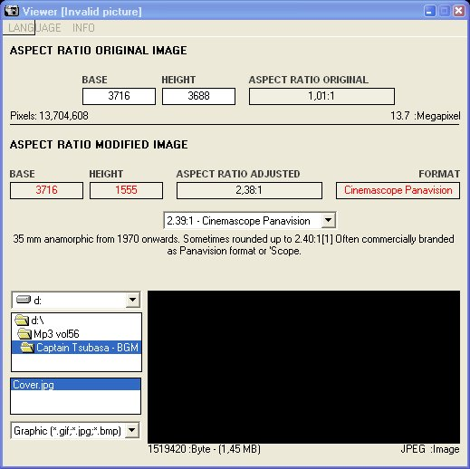



## Aspect Ratio calculator

### Description

This program computes the cutting of the images and the various pixels in megapixels. In addition, various measures are pre-configured to create video. It is in three languages, Italian, English, Spanish.

Questo programma calcola il taglio delle immagini e i vari pixel in megapixel. Inoltre, sono preconfigurate le varie misure per creare video. E' in tre lingue, italiano, inlgese, spagnolo.
 
### More Info
 

             |
---                |---
**Submitted On**   |2010-05-03 16:06:16
**By**             |[Ganzaborn](https://github.com/Planet-Source-Code/PSCIndex/blob/master/ByAuthor/ganzaborn.md)
**Level**          |Advanced
**User Rating**    |5.0 (20 globes from 4 users)
**Compatibility**  |VB 6\.0
**Category**       |[Graphics](https://github.com/Planet-Source-Code/PSCIndex/blob/master/ByCategory/graphics__1-46.md)
**World**          |[Visual Basic](https://github.com/Planet-Source-Code/PSCIndex/blob/master/ByWorld/visual-basic.md)
**Archive File**   |[Aspect\_Rat2225917132012\.zip](https://github.com/Planet-Source-Code/ganzaborn-aspect-ratio-calculator__1-73057/archive/master.zip)

